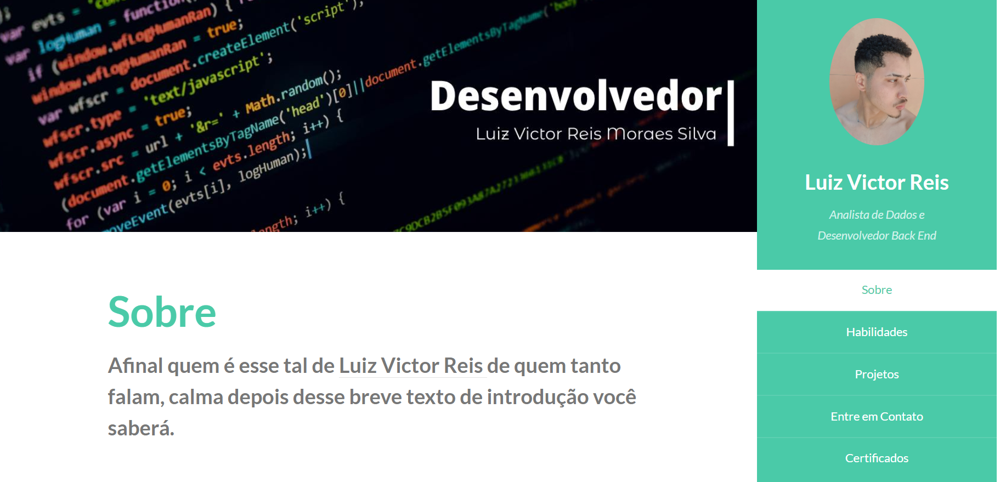

# Web-Portifolio 

Nosso Web-Portifólio foi feito utilizando Python e Django, a intenção do projeto e de ter um espaço para poder demonstrar minhas habilidades e certificados. 

## Sobre
Na era da informação ter um lugar para demonstrar suas habilidades e certificações é de extrema importância e sabendo disso, me veio a ideia de desenvolver um site onde eu poderia usar para expor minhas habilidades e projetos, dessa ideia surgiu o meu primeiro site que você caro leitor pode acessar clicando <a href=“https://luizv315.pythonanywhere.com“>aqui</a> ou acessar o projeto no<a href=“https://github.com/luiz315/portfo“>GitHub</a>, após algum tempo o antigo site passou a não satisfazer todas minhas necessidades, pensando nisso comecei um projeto para atualizar o site porem percebi que teria que refazer grande parte do front-end e design do site, então tomei a decisão de fazer um novo website. Abaixo podemos visualizar o site antigo.

  

Após pesquisar bastante encontrei no site <a href ="https://styleshout.com/free-templates/"> styleshout</a> um modelo, e então após atualizar as informações, atualizei a versão do font awesome para ter ícones e fontes atualizadas.

  

